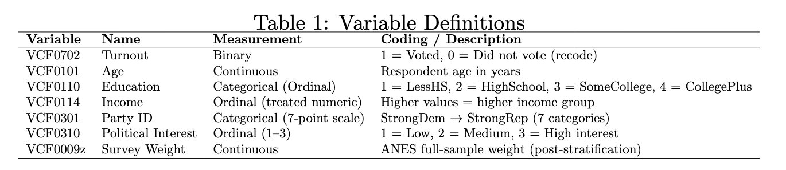

# Government/Politics Dataset | Implementation {.shrink}

**Research question**: to what extent do socioeconomic factors, specifically age, education, and income, predict voter turnout in American national elections?

We used a dataset provided by the American National Election Studies, detailing whether individuals voted or not in the 2024 election. The dataset had over 44 variables it considered, such as occupation and religion.

# Clean Data Explanation {.shrink}

Translating information from the codebook, we considered the variables below.

```{r, message=FALSE, warning=FALSE, echo=FALSE}
library(margins)

```

VCF0009z, considers if a survey accidentally talks to too many men and not enough women, the women’s answers are given a higher weight (they count for more than one person) and the men’s answers are given a lower weight (they count for less than one person).

We cleaned the dataset to only use the variables above

```{r, echo=FALSE}
df <- read.csv("../anes_cleaned.csv", stringsAsFactors = FALSE)


vars <- c("VCF0702",  # turnout
          "VCF0101",  # age
          "VCF0110",  # education
          "VCF0114",  # income
          "VCF0301",  # party ID
          "VCF0310",  # political interest
          "VCF0009z") # weights

df_clean <- df[, vars]

df_clean[df_clean < 0] <- NA

# Dependent Variable: Turnout (1 = voted, 0 = did not vote)
df_clean$vote <- ifelse(df_clean$VCF0702 == 2, 1,
                  ifelse(df_clean$VCF0702 == 1, 0, NA))

df_clean$age <- as.numeric(df_clean$VCF0101)

df_clean$education <- factor(df_clean$VCF0110,
                            levels = c(4,3,2,1),
                            labels = c("CollegePlus", "SomeCollege", "HighSchool", "LessHS"))

df_clean$income <- as.numeric(df_clean$VCF0114)

df_clean$party_id <- factor(df_clean$VCF0301,
                           levels = c(4,3,5,2,6,1,7),
                           labels = c("Independent",
                                      "IndLeanDem",
                                      "IndLeanRep",
                                      "WeakDem",
                                      "WeakRep",
                                      "StrongDem",
                                      "StrongRep"))

df_clean$interest <- as.numeric(df_clean$VCF0310)

df_clean$weight <- df_clean$VCF0009z


df_clean <- na.omit(df_clean)
```

# Topic 4 | Implementation {.shrink}

## Exploratory Data Analysis

```{r, comment=""}
chisq.test(table(df_clean$vote, df_clean$education))

chisq.test(table(df_clean$vote, df_clean$party_id))
```

\- For education, the test statistic is very large $X^2 = 3910.4$ with a p-value effectively equal to zero. We can confidently reject the idea that voting behavior is independent of education level.

\- For party identification, the chi-squared test $X^2 = 3694.5$ also produces a near-zero p-value, indicating a strong relationship between party ID and turnout.

# Topic 4 | Implementation {.shrink}

```{r, comment="", echo=FALSE}
model1 <- glm(vote ~ age + education + income + party_id + interest,
              data = df_clean,
              weights = weight,
              family = binomial(link = "probit"))

summary(model1)
```

Latent scores.

# Research Conclusion {.shrink}

```{r, comment=""}
mfx <- margins(model1)
summary(mfx)
```

# Research Conclusion {.shrink}

The average marginal effect (AME) of 0.0039 means that each additional year of age increases the probability of voting by about **0.4 percentage points**, holding other factors constant. This suggests that older individuals are more likely to vote.

Compared to individuals with a college degree (the baseline group), those with lower levels of education are significantly less likely to vote. For example, having only a high school education decreases the probability of voting by about **15.5 percentage points**

The AME of 0.0381 shows that moving up one income category increases the probability of voting by about **3.8 percentage points**.

Compared to independents, individuals who identify with a political party, especially strong partisans, are substantially more likely to vote. For example, strong Democrats and strong Republicans are about **20–22 percentage points more likely** to vote than independents.

Similarly, **political interest** has one of the largest effects in the model. The average marginal effect of 0.1076 indicates that moving up one level of interest increases the probability of voting by about **10.8 percentage points**.

Overall, while socioeconomic resources are important, these results show that political engagement and partisan identity are equally powerful predictors of turnout.

